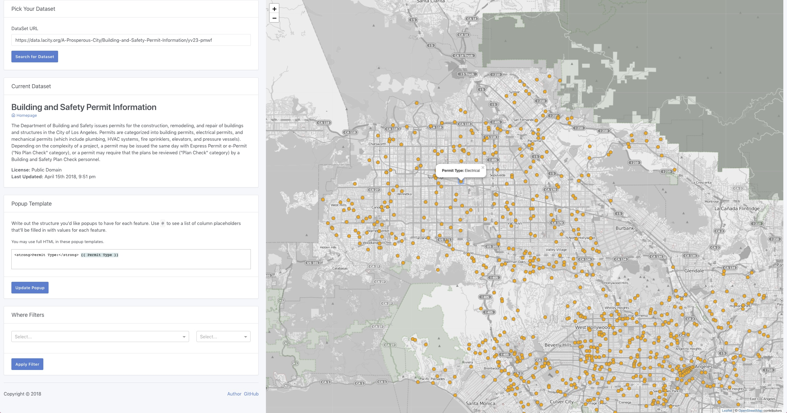

# nami

Welcome to my final project for Geography 408F WebGIS class. After making a project with Vue.js, I wanted to take a stab at creating something in React and see the differences.

nami is a very basic [Socrata](https://socrata.com/) dataset visualizer for datasets that contain location based information.

## License

MIT
